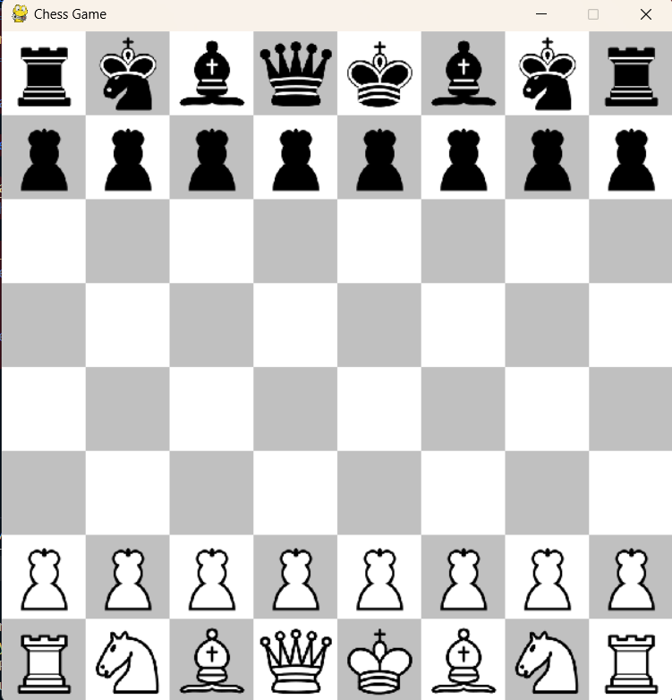
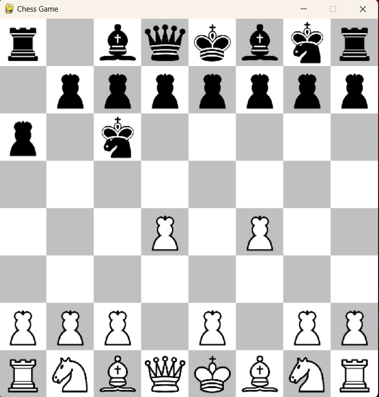
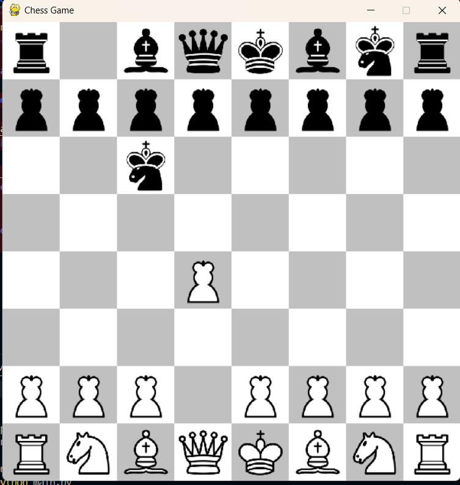

# [Project Name] 🎯

## Basic Details
### Team Name: CosYnot

### Team Members
- Member 1: Aiswarya Shine - SCMS
- Member 2: Athira Francis - SCMS

### Hosted Project Link
https://tink-her-hack-3-0.onrender.com

### Project Description
This chess engine simulates a full chess game, allowing users to play against each other or an AI opponent. It uses the minimax algorithm with alpha-beta pruning for decision-making and detects check and checkmate conditions.

### The Problem statement
Finding a robust chess engine that allows both manual gameplay and an AI opponent can be tricky, especially for beginners looking to understand how chess engines work.

### The Solution
We’ve built a chess engine that simulates the game, using advanced algorithms for decision-making and AI moves, while still keeping things simple for new players. It allows you to play against an AI opponent. We tried to build an reinforcement algorithm which helps the AI improve itself but could't because of the time contraint.

## Technical Details
### Technologies/Components Used
For Software:
- Languages used: Python
- Frameworks used: Flask
- Libraries used: python-chess,random
- Tools used: None

For Hardware:
- none

### Implementation
For Software:
# Installation
1) pip install pygame

# Run
cd your directory
python main.py

### Project Documentation
For Software:

# Screenshots (Add at least 3)

*Screenshot 1: This shows the initial setup of the chess game board.*

*Screenshot 2: This displays the move options for the selected piece.*

*Screenshot 3: This shows the game in progress, with pieces actively moving.*

# Diagrams

*Add caption explaining your workflow*

### Project Demo
# Video
[Add your demo video link here]
*Explain what the video demonstrates*

## Team Contributions
- Aiswarya Shine: Build mimmax pruning algorithm
- Athira Francis: Familiarization ans rules of chess

---
Made with ❤️ at TinkerHub
